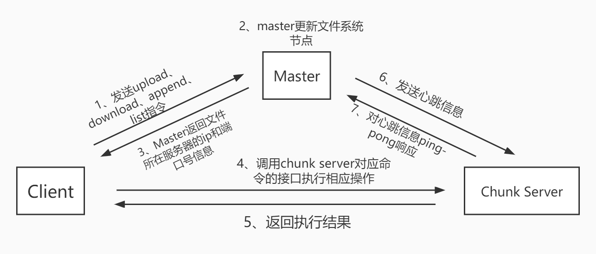
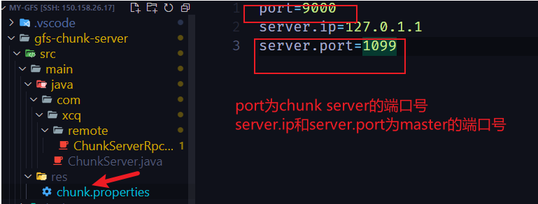

# 一、项目介绍
my-gfs是一个个人的分布式存储项目。主要是基于dubbo实现。目前项目还在开发当中。[我主要是参考了这个大佬的设计方案](https://gitee.com/maogen_ymg/daisy)。做这个项目主要是想实践一下分布式的项目。
# 二、项目流程图

# 三、项目进展
## 已完成
- [x] 完成了机器的心跳检测并通过回调方式完成机器的下线操作
- [x] 完成了单线程版本的文件上传以及下载接口
- [x] 基于注解进行配置
- [x] master节点上实现了文件系统的增查改删并且通过读写锁保证了文件系统的线程安全
- [x] 通过随机轮询算法实现文件服务器的分配
- [x] 基于aop思想在命令发送前对请求参数做统一处理
- [x] 对于master、chunk server以及client全局单例的需求实现了通用且线程安全版本的单例模式
## 未完成
- [ ] 文件在副本节点之间的拷贝
- [ ] 文件的append操作
- [ ] 客户端上的list操作
- [ ] 上传下载优化为多线程版本
- [ ] 轮询算法的优化
- [ ] 目前配置文件指定需要使用绝对路径，希望优化为使用相对路径
- [ ] 机器宕机后的容错处理
- [ ] 通过ack机制保证数据传输的可靠性
- [ ] 如何对故障节点进行数据恢复
- [ ] master节点高可用的保证(日志,主从)
# 四、想要做的一些优化点
主要想完成的点已经在未完成当中列出来了。有一些点这里还想具体列一下。
1. 想模仿mysql的LRU缓存机制实现文件服务器上的数据缓存。
2. 目前日志还是直接在控制台上进行输出，后面想用log4j这样的日志组件进行替换。
3. 测试大文件在这个文件系统的使用中是否存在bug
4. 进行压测
5. 实现类似文件同步的功能
6. 引入超时机制避免出现无限等待的情况
7. 如何对每一个切片进行数据校验防止出错

# 四、项目的运行
项目使用的环境为jdk11+maven,运行在ubuntu1804下。正常情况下无需配置，可以直接在idea或者vscode中打开运行，如果需要开启多个server的话，只需要修改子模块的res文件夹下的配置文件的端口号即可

最后希望大佬们能够给个星星，算是对小弟的鼓励，小弟一定感激不尽